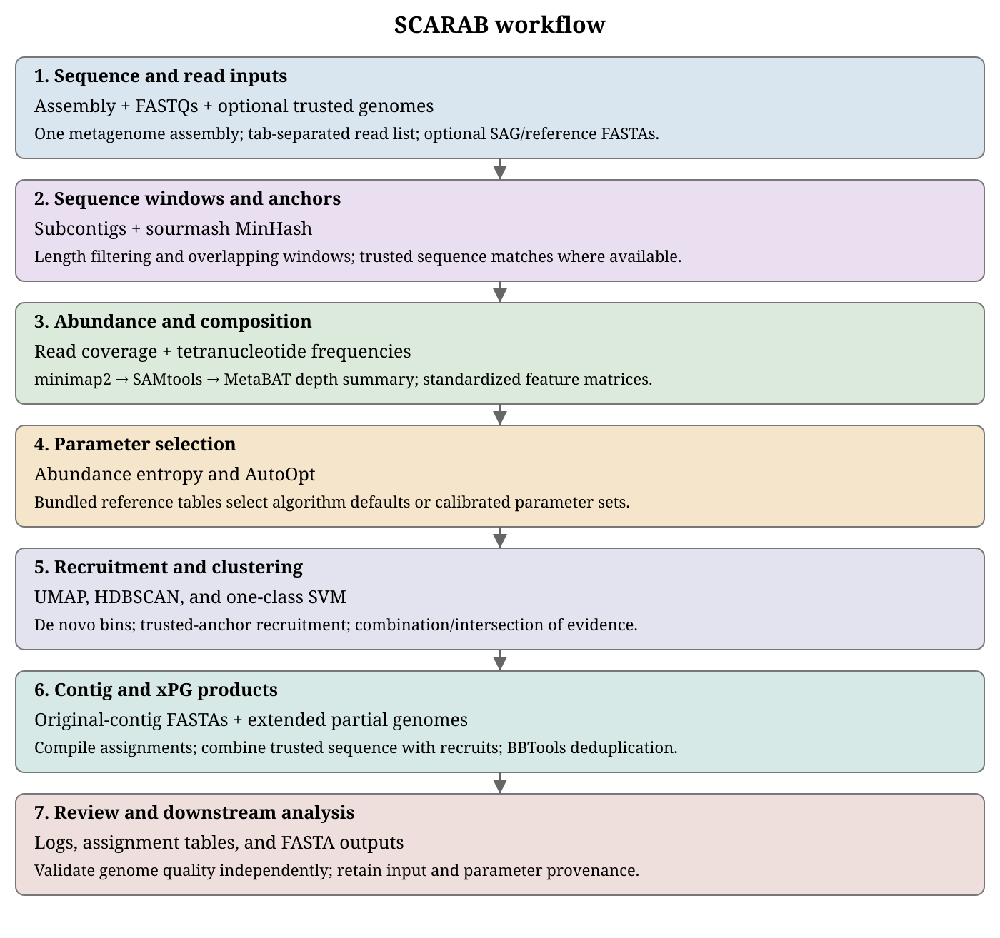

# SCARAB

**Documentation preview for SCARAB 1.0.0:** installation updates and runtime fixes described here are still being validated. Anaconda and Quay packages have not been published; this documentation branch is for review.

SCARAB recruits metagenomic reads using single-cell amplified genomes as references.

Start with a metagenome assembly and its reads. Add trusted genomes to anchor recruitment, then inspect the contig bins and extended partial genomes produced from composition, abundance, and sequence-similarity evidence.

[](assets/workflow-main.svg)

```{toctree}
:maxdepth: 2
:caption: Getting started

installation
quickstart
reviewer-test
inputs
```

```{toctree}
:maxdepth: 2
:caption: Workflow and interpretation

workflow
parameters
outputs
resources
cli-reference
troubleshooting
citations
```

```{toctree}
:maxdepth: 2
:caption: Maintaining SCARAB

development
documentation
```
