# SCARAB workflow

[Download SVG](assets/workflow-main.svg) · [Download PDF](assets/workflow-main.pdf)

## Conceptual overview

[Zoom diagram](assets/diagrams/conceptual.svg) · [Mermaid source](diagrams/conceptual.mmd)

## Software architecture

[Zoom diagram](assets/diagrams/architecture.svg) · [Mermaid source](diagrams/architecture.mmd)

## Detailed data flow

[Zoom diagram](assets/diagrams/data-flow.svg) · [Mermaid source](diagrams/data-flow.mmd)

The Python controller executes these stages in sequence; the parallel branches in the data-flow diagram describe contributing evidence, not independent Nextflow jobs. With trusted references, MinHash candidates inform the feature subset and high-similarity hits provide anchors. Without usable anchors, de novo processing can continue without anchored products. See [parameters](parameters.md), [outputs](outputs.md), and [citations](citations.md).
